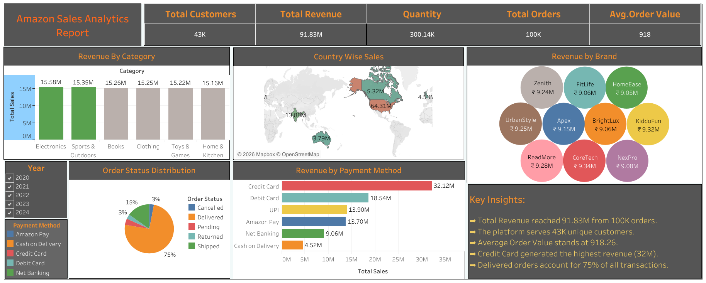

# amazon-sales-analytics
Amazon Sales Analytics dashboard built using Tableau to analyze sales performance, product trends and business KPIs.

# Amazon Sales Analytics

Tableau dashboard project analyzing Amazon sales data to identify sales trends, product performance and key business metrics.

## 📊 Project Overview

This project analyzes Amazon sales data using Tableau to understand sales performance, product trends and business KPIs.

The dashboard provides an interactive view of sales-related metrics and helps identify patterns across different dimensions of the business.

## 🎯 Business Objective

The objective of this project is to analyze Amazon sales data and develop an interactive dashboard that can be used to monitor sales performance and identify important business trends.

## 🛠️ Tools & Technologies

- Tableau
- Microsoft Excel
- Data Visualization
- Dashboard Development
- KPI Analysis

## 📊 Dashboard Preview

## 🔍 Analysis Performed

The dashboard analyzes areas such as:

- Sales performance
- Product performance
- Sales trends
- Category-level analysis
- Business KPIs
- Other relevant sales dimensions available in the dataset

## 💡 Key Insights

- Add your actual findings from the dashboard here.
- Mention the highest-performing categories/products.
- Mention important sales trends.
- Mention any noticeable patterns or variations.
- Include specific numbers where available.

## 🔗 Interactive Dashboard

[View Interactive Tableau Dashboard](https://public.tableau.com/views/AmazonSalesAnalyticsProject/Dashboard1?:language=en-US&:sid=&:redirect=auth&:display_count=n&:origin=viz_share_link)

## 🧠 Skills Demonstrated

- Data Cleaning
- Data Analysis
- Tableau
- Data Visualization
- Dashboard Development
- KPI Analysis
- Business Insights

